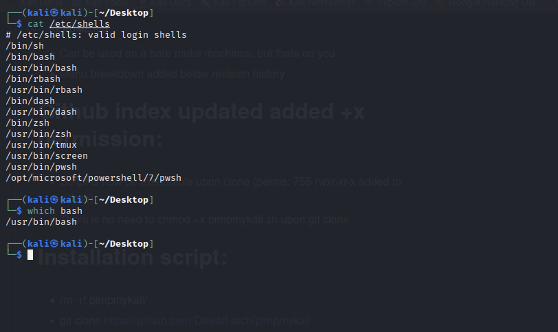

## Introduction to Linux

## Bash programming

- BASH - Bourne Again Shell
- Command line interpreter that typically runs in text window where user can interpret commands to carry out various actions.
- Combination of these commands as a series combined within a file is known as **shell script.**
- Bash can read and execute the commands from a shell script
- Shell commands are interpreted not compiled.
- There are different types of shells available in Linux Operating Systems - Bourne Shell - C Shell - Korn ShellGNU Bourne Shell -  
  To know which shell types your OS supports, type the fwolloing command `cat /etc/shells` and `which bash` to know where the bash is located

### Features of Bash

- Bash is sh-compatible: it incorporate useful features of Korn and C shell like directory manipulation, job control, aliases, etc.
- it is incovked by single-character command like (-a,-b,-c,-i,-r etc.) as well as multi character command line options like --debugger, --help, --login etc.
- Start-up files are used by the script to create an environment when the base starts.
- consits of key-bindings and contains one-dimensional arrays.
- strict nmode bash environemnt has storng security. A shell get restricted if bash starts with name rbash, or the bash --restricted or bash -r option passed at invocation.
- bash script is a computer program written in the Bash Programming langauge.

To create a file run `touch filname.sh`

- The first line of bash starts with specifying the location of bash shell in our operating system. we do this as follows:
  `#!/bin/bash` (No space between); `#!` is known as SheBang and `/bin/bash` is location of the bash.
