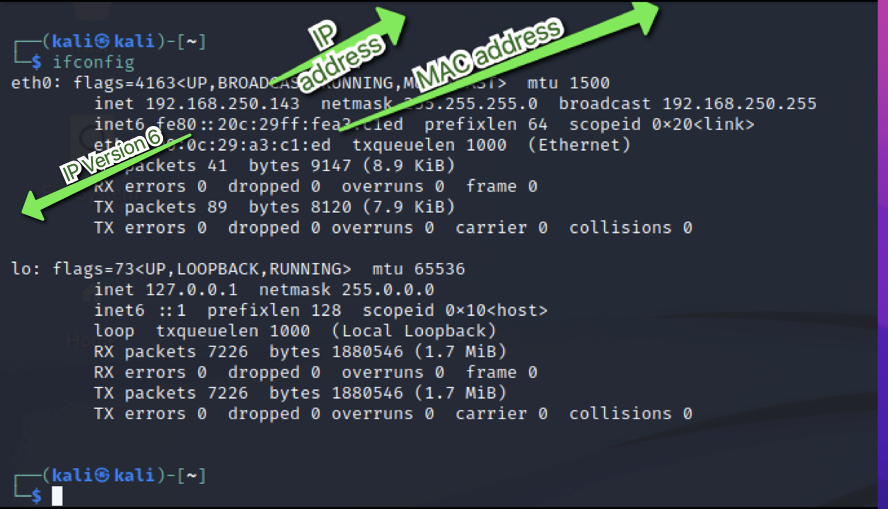
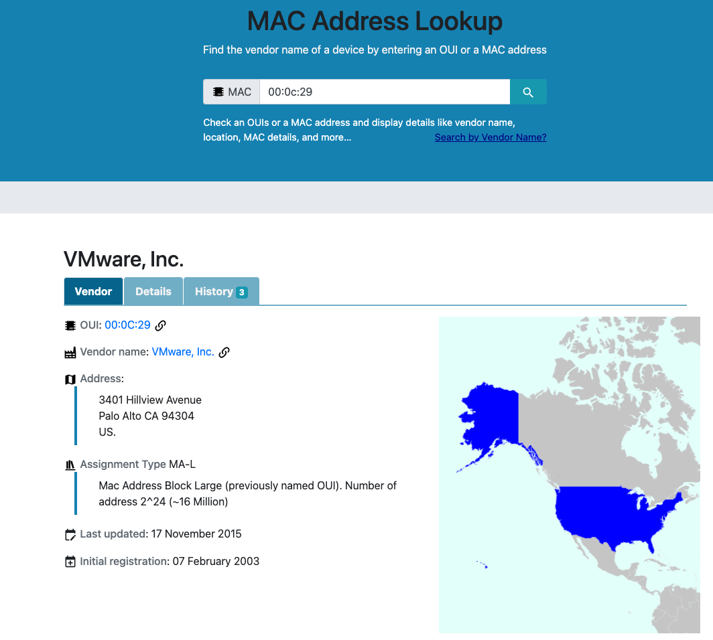

# Networking Refresher

**Topics to cover**

- IP Addresses
- MAC Addresses
- TCP, UDP, and Three-Way Handshake
- Common Ports and Protocols
- The OSI Model
- Subnetting

**IP Addresses**

- Layer 3 protocol
- used for routing across the network
- ifconfig (ip a): Gives information about connectivity and network related information of the machine

inet : 32 bit ip address
inet6: 128 bit ip addres

inet (ipV4) is not enough address for all the devices in the world. To solve this, we use Network Address Translation (NAT). We assign private address spaces to our local network.

More information can be found:
https://www.avast.com/c-ip-address-public-vs-private

**MAC address**

- are layer 2 physical addresses
- are used by switches
- are unique globally
- have identifiers
- it has 6 pairs of addresses, the first three identifies the vendor

https://maclookup.app/

**TCP vs UDP**

These are transport layer protocols used to setup connection.

- TCP: Transport Communication Protocol: Used to establish connection oriented communication
- UDP: User Datagram Protocol: Used to establish connectionless communication

**Common ports and protocols**

| TCP | UDP |
| --- | --- |
| FTP (21) | DNS (53) |
| SSH (22) | DHCP (67,68) |
| Telnet (23) | TFTP (Trivial FTP) (69) |
| SMTP (25) | SNMP (Simple Network Management Protocol) (161) |
| DNS (53) |     |
| HTTP(80) |     |
| HTTPS (443) |     |
| POP3 (110) |     |
| SMB(**139** \+ **445**) (samba and file shares |     |
| IMAP (143) |     |

**OSI Model**

1.  **Please** (Physical) - Data cables, Cat 6
2.  **Do** (Data link) - Switching, MAC addresses
3.  **Not** (Network) - Ip addresses, routing
4.  **Throw** (Transport) - TCP /UDP
5.  **Sausage** (Session) - Session management
6.  **Pizza** (Presentation) - WMV, JPEG, MOV, encrypt, compresses, translate, encode
7.  **Away** (Application) - HTTP, SMTP, HTTPS

Troubleshooting starts from Physical layer ---> and ends at Application layer

Subnetting is another important concept to know when working in security (https://www.youtube.com/watch?v=ZxAwQB8TZsM) has good video about networkign.